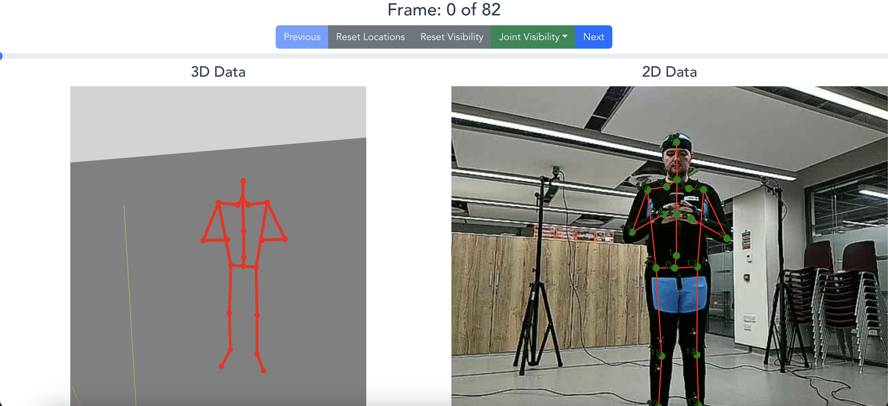
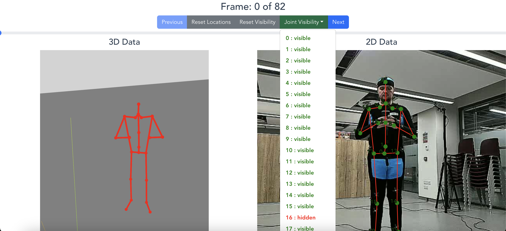
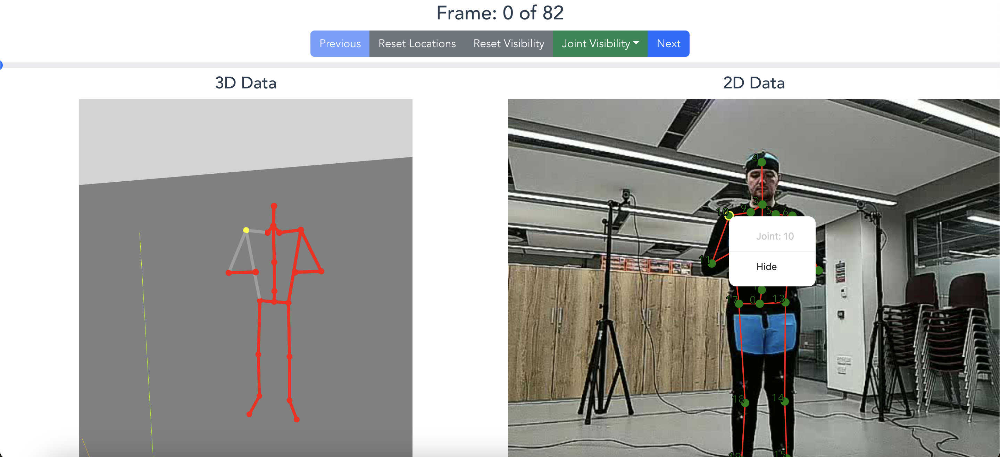

# Human pose annotation tool
Annotation tool for 2D and 3D pose estimation. The tool is designed to work with custom datasets and supports both 2D and 3D annotations. The tool is built with the idea in mind of having a simple and easy-to-use interface for annotating images and videos for human pose estimation problems.

With this tool, the following features are supported:
- 2D human pose annotation on images or videos;
- Support for hidden joints;
- 3D human pose visualization;
- Custom dataset support;

<!-- Insert example image with description -->
## Annotation example
For instance, if the 3D data is provided, the tool will display the 3D pose of the person in the image. If the 3D data is not provided, the tool will still work and allow the user to annotate the 2D pose of the person in the image.


Also, in the case of 3D data provided, when moving a 2D joint, its corresponding 3D joint is highlighted in the 3D visualization. This feature is useful to check if the annotation and 3D data are correct.


### Hidden joints

The tool supports the hidden joints annotation. It is possible to mark individual joints as hidden. They will not be displayed in the 2D visualization, but they will be saved in the annotation file with a special flag. This feature is useful when the joints are occluded by other objects or people, or they are outside the camera's view frustum.







## Requirements
1. Install [Node.js](https://nodejs.org/en/download/). If you want you can use `nvm` to manage multiple versions of Node.js. The project has been tested with **Node.js v21**, and **npm version 10.**

2. Install [Python3](https://www.python.org/downloads/). If you want you can use [miniconda3](https://docs.conda.io/en/latest/miniconda.html) to create a virtual environment. The project uses the new type-checking syntax, so you will need **Python 3.9** or later.

3. Install the python dependencies by executing `pip install -r requirements.txt` in the root directory of the project.

## Installation
1. Execute `npm install` in the root directory of the project to download the node modules.
2. Execute `npm run build` to build the project. This will create a `backend/dist` directory with the compiled files.

## Main server run
1. (Optional) Set your port in the script `backend/cfg.py` (default=51100).
2. Execute `python backend/server.py` to start the server. The server will be running on `http://localhost:51100`.

## Custom dataset support

The project supports custom datasets. To add a new dataset, you need to:

1. Create a new dataloader class that inherits from `backend.dataset.definition.AnnotationDataset` and implement all the abstract methods. 

2. Create a configuration yaml file. The configuration file should be placed in the `backend/configs/` directory. The configuration file should contain the following fields:

```yaml
name: "<dataset name (no spaces)>"
data_root: "<data root directory>"
dataloader_script: "<location of the dataloader>"
dataloader_class: "<name of the dataloader python class>"
joints_number: <integer, number of the joints to annotate per each image>
joints_links: <list of lists, each list contains the indexes of the joints that are connected. (Optional)>
joints_names: <list of strings, each string is the name of the joint. (Optional)>
```

## What if I don't have the 3D joints? Can I still use this tool to annotate my images?
Yes. Just provide the 3D data joints as empty lists. The tool will still work.


## Where are my annotations?

Each video file or image is annotated with a `<name>_annotation.pkl>` file, where `<name>` is the source file name. The file is a dictionary with the following fields:

